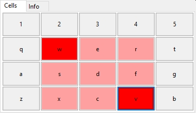

# PosIt

© Andrii Dovhopolyi, 2021, andridov@gmail.com

The script of positionsing windows  on the screen.




## How does it work?

1. Select your window to move/resize.
2. Imagine your desktop area divided in to cells:
```
┌───┬───┬───┬───┬───┐
│ 1 │ 2 │ 3 │ 4 │ 5 │
├───┼───┼───┼───┼───┤
│ q │ w │ e │ r │ t │
├───┼───┼───┼───┼───┤
│ a │ s │ d │ f │ g │
├───┼───┼───┼───┼───┤
│ z │ x │ c │ v │ b │
└───┴───┴───┴───┴───┘
```
Press key combination for needed cells ratio. 
Example:
    Right WIN+CTRL+D activates script with ability to move window on any of 3x3 cells.

3. Define the bounding cells by pressing appropriate keys.
4. Press Enter to commit or Esc to quit.


## External requirements

You need [AutoHotkey](https://www.autohotkey.com) application to enable hotkeys on Windows OS. 
run the win_resize.ahk file. This enables you to run resize scrpt with hotkeys:
left WIN+CTRL+C


## Building with python

### modules required

WxPython needed. 

```
pip install -f python_dependencies.txt
```

## Runing

1. Change SetWorkingDir in win_resize.ahk. 
2. Load win_resize.ahk with AutoHotkey
3. Press `Right WIN`+`CTRL`+`one_of[3 4 5 e r t a s d f g z x c v b]`

